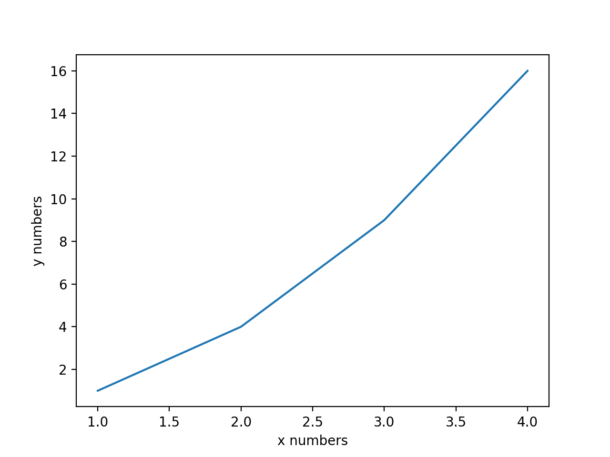

[comment]: <> ([image1]: placeholder.png "placeholder")

# Deep Q Learning Navigation: Banana Picker

In this project, an agent was trained to navigate an environment to pick yellow bananas while avoiding blue ones. The 
reward system is such that the agent receives a reward of +1 for picking a yellow banana and -1 for picking a blue one.
The agent is considered to have been trained successfully if it gets an average cumulative score of +13 

[comment]: <> (![placeholder][image1])

